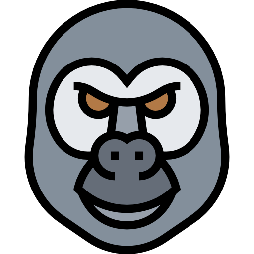
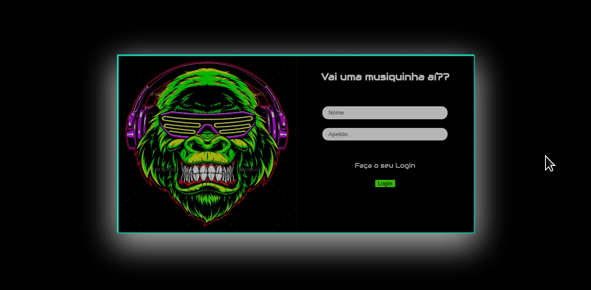

  

  # Monky
  
Projeto com proposta de fazer um site que imitasse o Sotify utilizando a API da labenu - Labefy.
 
  <a href="https://monky-labefy.surge.sh/"><button cursor='pointer'>Monky</button></a>

 
 
  

<h3 Align="center"> 
	🚧 🚀 Finalizado <a href="https://monky-labefy.surge.sh/"><button cursor='pointer'>Monky</button></a> 🚀 🚧 
</h3>

 
 

### Features

- [x] Login
- [x] Visualização das músicas;
- [x] vizualização das playlist;
- [x] Adicionar uma nova música(especifica da API) a playlist;
- [x] Styled desktop

 
 

## 🛠 Tecnologias

As seguintes ferramentas foram usadas na construção do projeto:

- [React](https://pt-br.reactjs.org/)
- [Javascript](https://developer.mozilla.org/pt-BR/docs/Web/JavaScript)
- [Styled-Component](https://styled-components.com/)
- [API REST](https://documenter.getpostman.com/view/9133542/TzCTZkQr)

 
 

<a href="https://monky-labefy.surge.sh/"><button cursor='pointer'>Monky</button></a>

### Autor
---

<a href="https://www.linkedin.com/in/camily-abade-4a663919a/">
 
  
 <b>Camily Abade</b></a> <a>🚀</a>

Feito com ❤️ por Camily Abade 👋🏽 Entre em contato!

 
